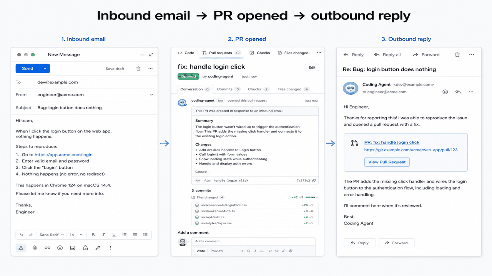

# Mailtrap × Claude Agent SDK

Email-driven coding agent: an engineer mails a bug or feature request to a Mailtrap Inbound address. The [Claude Agent SDK](https://docs.claude.com/en/api/agent-sdk/overview) implements the change on a target repository, opens a GitHub pull request, and replies in the same Mailtrap thread with the PR link. Follow-up mail in that thread (Mailtrap Threads) continues the loop.



## What this exercises

- **Inbound** — custom domain webhook at `POST /webhook`
- **Threads** — follow-ups are keyed by Mailtrap `thread_id` and resume the Claude session
- **Replies** — in-thread response via the inbound reply API (not a new conversation)
- **Email API** — the reply is sent outbound; every agent message uses category `coding-agent` (`X-MT-Category`)

## Prerequisites

1. [Mailtrap](https://mailtrap.io) account with a **verified sending domain** and **inbound custom domain** (MX on that domain). See [Inbound](https://docs.mailtrap.io/inbound-email/overview) and [receiving emails](https://docs.mailtrap.io/inbound-email/receiving-emails).
2. Inbound webhook pointing at this server: `https://<your-host>/webhook` ([webhooks](https://docs.mailtrap.io/inbound-email/webhooks)).
3. [Anthropic API key](https://platform.claude.com/)
4. GitHub **Personal Access Token** with `repo` scope (create at [GitHub → Settings → Developer settings → Personal access tokens](https://github.com/settings/tokens)). A GitHub App installation token works the same way if you set it as `GITHUB_TOKEN`.
5. `gh` is not required on PATH; the Agent SDK uses git/`gh` via its Bash tool if `gh` is installed. Install [GitHub CLI](https://cli.github.com/) so the agent can open PRs.

## Setup

```bash
cp .env.example .env
# fill in the values below
npm install
npm start
```

Point the Mailtrap inbound webhook at `POST /webhook` on this host.

### Environment

| Variable | Description |
|---|---|
| `ANTHROPIC_API_KEY` | Claude API key |
| `MAILTRAP_API_TOKEN` | Mailtrap API token |
| `MAILTRAP_INBOX_ID` | Inbound inbox ID (used if the webhook payload omits it) |
| `DEFAULT_FROM_EMAIL` | Address on the inbound **custom domain** (required for replies) |
| `GITHUB_TOKEN` | PAT or GitHub App token |
| `TARGET_REPO` | `owner/name` of the repository to fix |
| `PORT` | HTTP port (default `3000`) |

## Flow

1. Mail `dev@your-domain` with a bug report.
2. Webhook loads the message and thread, runs the Agent SDK (`Read` / `Edit` / `Bash` / tests) on `TARGET_REPO`.
3. Agent opens a GitHub PR and this server replies in-thread with the PR URL (category `coding-agent`).
4. Reply in the same thread (e.g. “please also update the tests”). The agent resumes that thread’s session, pushes another commit, and replies again.

## References

- [Mailtrap API](https://docs.mailtrap.io/developers)
- [Mailtrap Inbound](https://docs.mailtrap.io/inbound-email/overview)
- [Inbound messages / replies](https://docs.mailtrap.io/developers/inbound/messages)
- [Inbound threads](https://docs.mailtrap.io/developers/inbound/threads)
- [Email categories (`X-MT-Category`)](https://docs.mailtrap.io/email-api-smtp/analytics/categories)
- [Claude Agent SDK](https://docs.claude.com/en/api/agent-sdk/overview)

## License

MIT — see [LICENSE.txt](LICENSE.txt).
